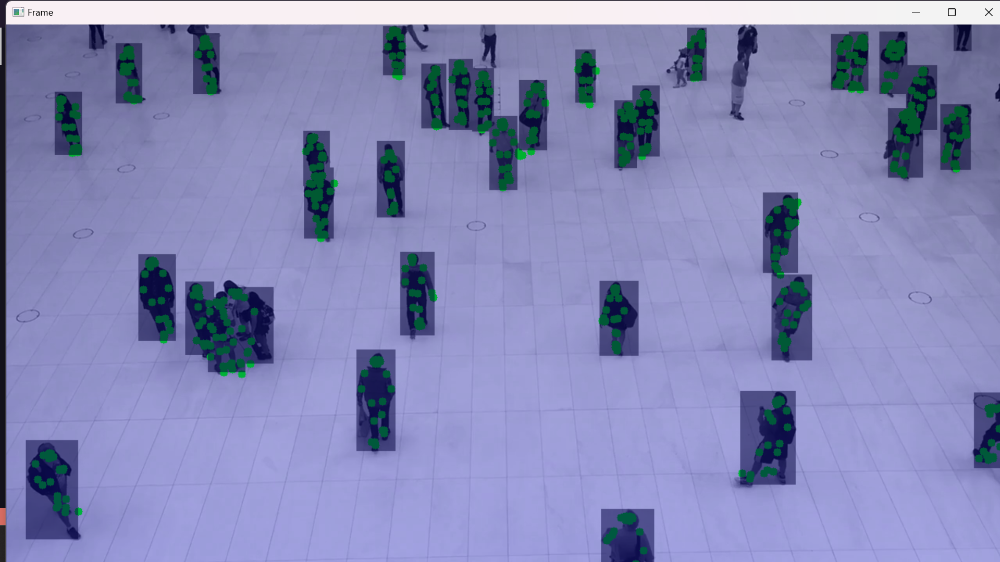
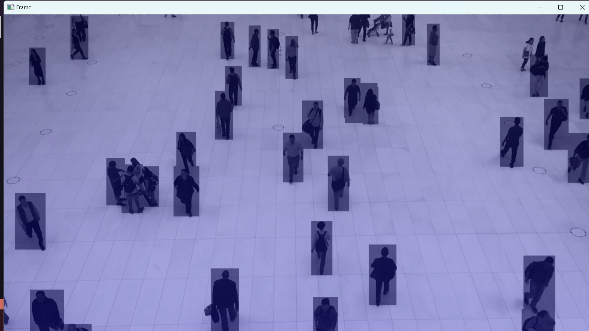

## Real-Time Person Detection with Landmark Detection and Depth Estimation

This project is aimed at detecting persons in real-time video streams, drawing landmarks on their bodies, and estimating the depth of each detected person. It utilizes computer vision techniques and deep learning models to achieve these tasks.


## Features
- Real-Time Person Detection: Utilizes YOLOv5, a state-of-the-art object detection model, to detect persons in real-time video streams.
- Landmark Detection: Employs MediaPipe Pose, a powerful pose estimation library, to detect landmarks on the bodies of detected persons.
- Depth Estimation: Utilizes MiDaS, a depth estimation model, to estimate the depth of each detected person.
- Visualization: Draws bounding boxes around detected persons, landmarks on their bodies, and overlays depth maps on the video frames for visualization.


## Prerequisites
Before running the project, ensure you have the following dependencies installed:
- Python 3.x
- OpenCV
- Torch
- NumPy
- Mediapipe
- Timm

You can install the dependencies by running:

````
pip install opencv-python opencv-python-headless torch torchvision matplotlib timm mediapipe
````

## Usage
To run the project, execute the following command:

````
py app.py
````

## Output
The output will be displayed in a new window showing the real-time video stream. Detected persons will be outlined with bounding boxes, landmarks will be drawn on their bodies, and depth maps will be overlayed on the frames.

** With landmarks drawing


** Without landmarks drawing


## Acknowledgments
- YOLOv5: Ultralytics/YOLOv5
- MiDaS: Intel-isl/MiDaS
- MediaPipe: Google/MediaPipe


## License
This project is licensed under the MIT License.